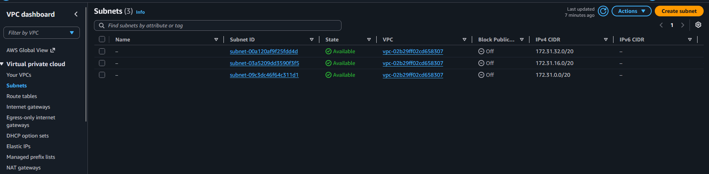
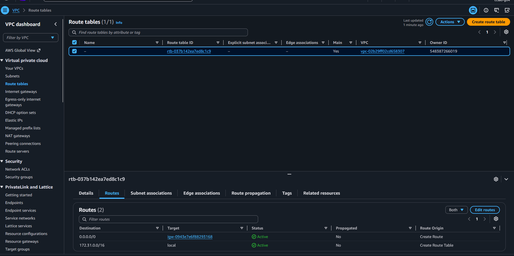
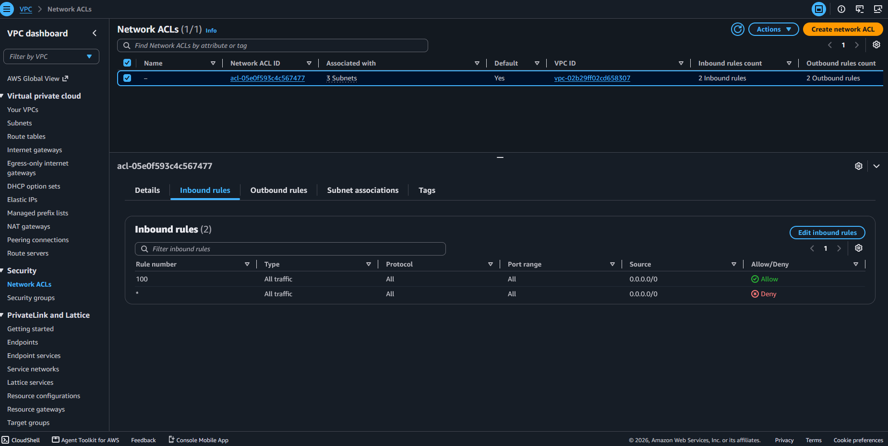
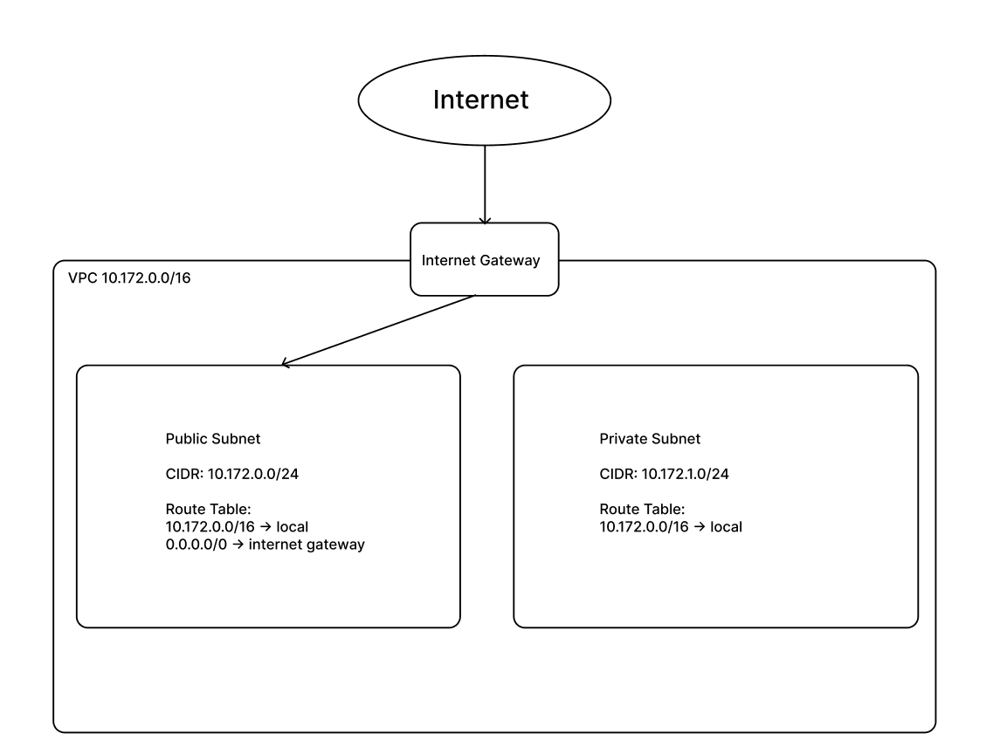

# Assignment 2 Submission

## About me

- GitHub username: ScarlettRed6
- Section: IV - CCSAD
- IAM user name that I signed in with: ccsad-g04
- X: 172

---

## Part A. Explore

### A1. The VPC

Default VPC IPv4 CIDR:

`172.31.0.0/16`

Number of addresses in that CIDR:

65,536

### A2. The subnets

| Availability Zone | IPv4 CIDR |
| --- | --- |
| `ap-southeast-1a` | `172.31.0.0/20` |
| `ap-southeast-1b` | `172.31.16.0/20` |
| `ap-southeast-1c` | `172.31.32.0/20` |

Screenshot 1. Save it as `screenshot-1-subnets.png` in your folder. The image line below shows it.

### A3. Available addresses

Available IPv4 addresses in each subnet:

`ap-southeast-1a` 4,091, 
`ap-southeast-1b` 4,091, 
`ap-southeast-1c` 4,091

Why is the number lower than 4,096?

A /20 subnet has 4,096 total addresses. AWS reserves the first 4 addresses and the last address (5 reserved addresses in total) in every subnet for network routing, DNS, and internal management. Therefore, 4,096 - 5 = 4,091 usable addresses.

What uses the missing address in the subnet with the lowest number?

Network interfaces (ENIs) attached to active resources like running EC2 instances hold an IP address in that subnet. If one subnet shows 4,090 or fewer, the missing address is assigned to an active instance or interface running in that Availability Zone.

### A4. The route table

| Destination | Target |
| --- | --- |
| `172.31.0.0/16` | `local` |
| `0.0.0.0/0` | `igw-...` |

Screenshot 2. Save it as `screenshot-2-routes.png` in your folder. The image line below shows it.

### A5. Public or private

Are the default subnets public or private? Which route proves it?

Public. The route `0.0.0.0/0` sends traffic to the internet gateway (`igw-...`).

### A6. The internet gateway

State of the internet gateway:

Attached

What happens to the default subnets if the gateway is detached?

The route `0.0.0.0/0` loses its active target, so the default subnets lose all bidirectional connectivity to the internet. However, instances within the subnets can still communicate with each other internally using the `local` route.

### A7. NAT gateways

Number of NAT gateways:

0

Can a server in a new private subnet download updates? Why?

No. A private subnet does not have an internet gateway route, and because there are 0 NAT gateways in the VPC, outgoing traffic has no path to reach the internet to fetch updates.

### A8. The network ACL

| Rule number | Source | Allow or Deny |
| --- | --- | --- |
| 100 | `0.0.0.0/0` | Allow |
| `*` | `0.0.0.0/0` | Deny |

How is a network ACL different from a security group?

A network ACL operates at the subnet boundary and is stateless, requiring explicit rules in both directions (inbound and outbound). A security group acts directly on individual instances and is stateful, meaning return traffic is automatically permitted regardless of inbound rules. Additionally, network ACLs support explicit Deny rules evaluated in numerical order, whereas security groups only support Allow rules.

Screenshot 3. Save it as `screenshot-3-network-acl.png` in your folder. The image line below shows it.

### A9. The default security group

Inbound rule (type and source):

All traffic from the default security group itself (source: `sg-...`).

Which resources can send traffic to an instance that uses it?

Only other instances and resources that are explicitly assigned to the same default security group.

---

## Part B. Prepare

### B1. Plan two subnets

- Public subnet CIDR: `10.172.0.0/24`
- Private subnet CIDR: `10.172.1.0/24`

### B2. Route tables

Route table of the public subnet:

| Destination | Target |
| --- | --- |
| `10.172.0.0/16` | `local` |
| `0.0.0.0/0` | `internet gateway` |

Route table of the private subnet:

| Destination | Target |
| --- | --- |
| `10.172.0.0/16` | `local` |

### B3. My VPC diagram

Tool used (Excalidraw, draw.io, Lucidchart, or paper):

Figma

Save your diagram as `vpc-diagram.png` in your folder. The image line below shows it.

### B4. Predict a change

Can you still open the web page from your laptop? Why?

No. Removing the `0.0.0.0/0` route cuts off the network path between the internet and the instance, making it unreachable from an external client even if the instance has an assigned public IP address.

Can the instance still reach another instance in the VPC? Why?

Yes. The `local` route for `10.172.0.0/16` remains active in the route table, which routes traffic between all subnets within the VPC.

### B5. Place a database

Which subnet gets the database? Why?

The private subnet (`10.172.1.0/24`). Its route table has no route to an internet gateway, shielding the database from direct exposure to the public internet while allowing the application server in the public subnet to connect via the local route.

### B6. My question about VPCs

What is your question, and what made you think of it?

Can two separate VPCs communicate with each other directly if they use the same CIDR block (like two default VPCs using 172.31.0.0/16)? I thought about this because many default VPCs share identical IP ranges, which would i think normally create an IP routing conflict.
